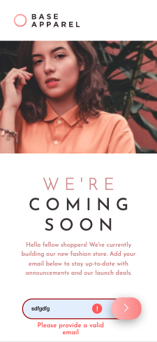

# Frontend Mentor - Base Apparel coming soon page solution

This is a solution to the [Base Apparel coming soon page challenge on Frontend Mentor](https://www.frontendmentor.io/challenges/base-apparel-coming-soon-page-5d46b47f8db8a7063f9331a0). Frontend Mentor challenges help you improve your coding skills by building realistic projects. 

## Table of contents

- [Overview](#overview)
  - [The challenge](#the-challenge)
  - [Screenshot](#screenshot)
  - [Links](#links)
- [My process](#my-process)
  - [Built with](#built-with)
  - [What I learned](#what-i-learned)
  - [Continued development](#continued-development)
  - [Useful resources](#useful-resources)
- [Author](#author)

## Overview

### The challenge

Users should be able to:

- View the optimal layout for the site depending on their device's screen size
- See hover states for all interactive elements on the page
- Receive an error message when the `form` is submitted if:
  - The `input` field is empty
  - The email address is not formatted correctly

### Screenshot




### Links

- Solution URL: [Portfolio](https://gelatodigital.com/#portfolio)
- Live Site URL: [https://rodrigo-base-apparel-coming-soon.netlify.app/?mail=](https://rodrigo-base-apparel-coming-soon.netlify.app/?mail=)

## My process

### Built with

- Semantic HTML5 markup
- CSS custom properties
- Flexbox
- CSS Grid
- Mobile-first workflow
- JavaScript email form validation

### What I learned

Lots of cool tricks:

For styling the ! icon:
```css
.icon {
    display: none;
}
.invalid ~ .icon{
    position: absolute;
    display: unset;
    right: 31vw;
    top: 30%;
}
```

For styling the button once it is clicked:
```css
button:active{
    background-image: linear-gradient(to right, hsl(0, 0%, 100%) ,hsl(0, 80%, 86%));
    box-shadow: -1px 7px 24px -4px rgba(0,0,0,0.82);
}
```

For validating the email:
```js
var emailRegExp = /^[a-zA-Z0-9.!#$%&'*+/=?^_`{|}~-]+@[a-zA-Z0-9-]+(?:\.[a-zA-Z0-9-]+)*$/;

```

### Continued development

Got to move away from hard coding padding values, given that that scale bad for super thin screens and ipad size screens.

### Useful resources

- [Email form validation](https://developer.mozilla.org/pt-BR/docs/Learn/Forms/Form_validation)

- [Error icon](https://stackoverflow.com/questions/48713457/add-an-icon-to-input-field-when-invalid-value-entered)

## Author

- Website - [Rodrigo Barbosa](https://www.gelatodigital.com)
- Frontend Mentor - [@Rod-Barbosa](https://www.frontendmentor.io/profile/Rod-Barbosa)
